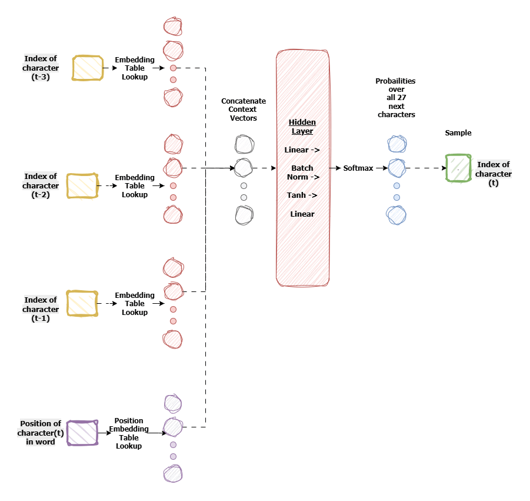
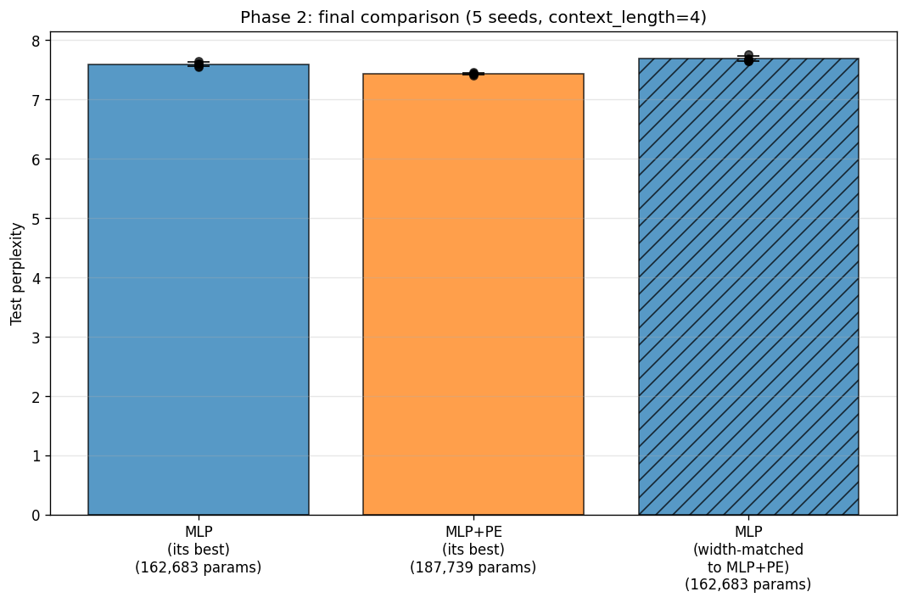
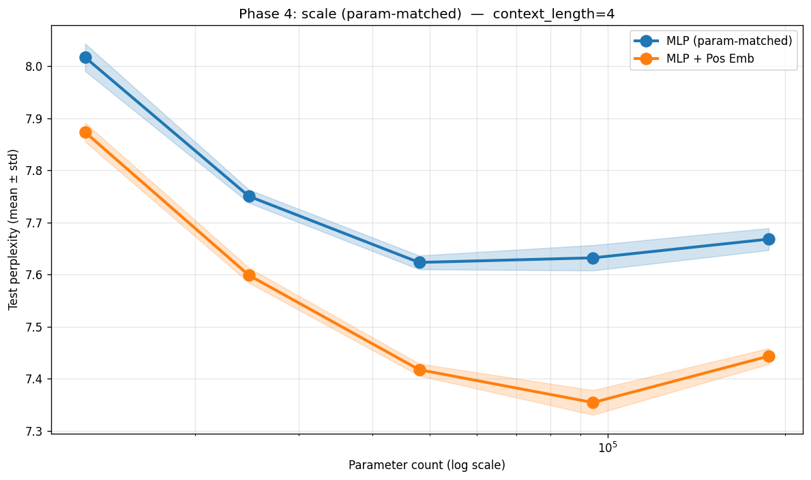
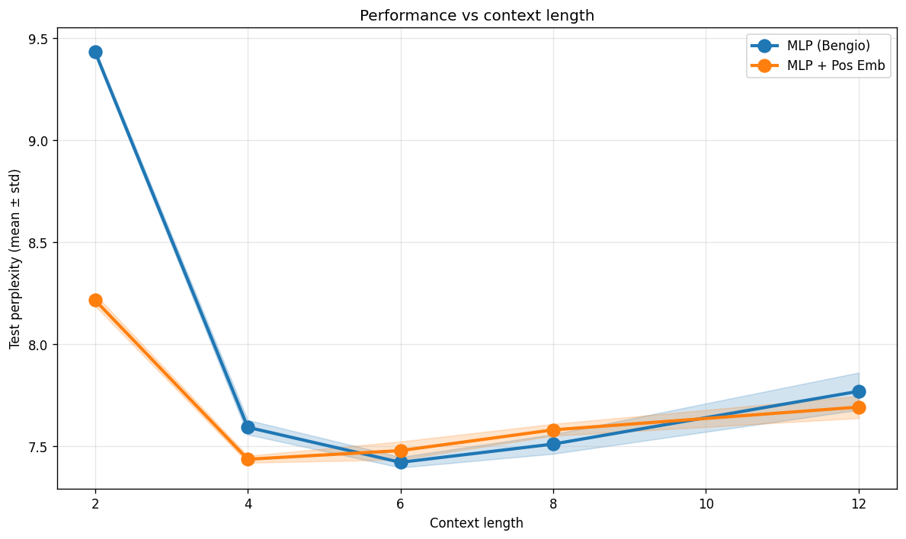

Working through Karpathy's makemore series, I built a Bengio-style MLP for character-level name generation and noticed something simple. The model takes a window of characters and predicts the next one. A window like `"ari"` is the ending of "Mari" — the model should output a period. But it's also the middle of "Maria" (output `"a"`), "Marina" (`"n"`), and "Maribel" (`"b"`). The window is identical; the targets aren't. The model has no way to know which name it's in.

It can't see where it is.

A natural fix is to tell it. Add a position embedding alongside the word embedding and let the model look up its own location within the name. The change is small — a second embedding table, concatenated with the word embedding before the first Linear — but it raises a more interesting question than *does it work?*

I wanted to know *why* it worked, when it did. Does pos-emb help because it adds parameters, or because it adds information? If information, what information, and when does the model actually need it? Those questions turned into a set of experiments, and the experiments turned into a way of thinking about the architectural change that I hadn't started with.

That framing is the thing I most want to share here: architectural choices encode priors about what the model can see — usually more than one prior at a time, and those priors can be tested separately.

## Setup

The dataset is 32,000 names — Karpathy's `names.txt`. The model is a small Bengio-style MLP: each character is mapped to an embedding, a window of `C` consecutive embeddings is concatenated, passed through one hidden layer with BatchNorm and a Tanh nonlinearity, and projected to a distribution over the next character.

The shape of the forward pass:

```
(B, C) → embed → (B, C·E) → Linear → BN → Tanh → Linear → (B, V)
```

with vocab size `V = 27` (26 letters plus the end-of-name marker `.`). Names are padded on the left with dots, so the very first character of every name sees a window of pure dots.


What the model can see is the immediately preceding `C` characters. What it can't see is where it is within the name. A 4-character window of `"...."` and a 4-character window of `"phie"` look like completely different inputs, but once the window fills with real letters, the dot-padding signal that originally encoded position is gone. The model has no way to recover *how far into this name am I?* from its inputs alone — and the architecture as built gives it no other channel.

That gap is what the position embedding is supposed to close.

## The variant

The architectural change is small — a second embedding table indexed by position, concatenated with the word embedding before the first Linear:

```python
class MLP_PE(nn.Module):
    def __init__(self, V, C, E, H, max_pos, P):
        super().__init__()
        self.word_emb = nn.Embedding(V, E)
        self.pos_emb  = nn.Embedding(max_pos, P)              # new
        self.h   = nn.Linear(E * C + P, H)                    # wider input
        self.bn  = nn.BatchNorm1d(H)
        self.out = nn.Linear(H, V)

    def forward(self, x, pos):
        x_w = self.word_emb(x).flatten(1)
        x_p = self.pos_emb(pos)                               # new
        h   = torch.tanh(self.bn(self.h(torch.cat([x_w, x_p], dim=1))))
        return self.out(h)
```

`pos` is the within-name index — 0 for the first prediction in a name, incrementing by one per step. A few hundred extra parameters in the pos-emb table; the first Linear gets a slightly wider input. Architecturally, nothing else changes.



The thing I didn't realize at first is that this small change bundles two separate claims into one architectural decision. Once I started running experiments, those two claims turned out to be testable individually — which is how the rest of this post is organized.

**Prior A — position carries information.** A claim about the data. Some characters are common at the start of names ("A", "J", "M"), some predominantly mid-name, some at the end. If position were random with respect to character distribution, no embedding could help.

**Prior B — the model cannot recover position from the local window alone.** A claim about the architecture. With a small context window, once it fills with real letters, there's no signal distinguishing position 3 from position 8. With a wide enough window, the dot-padding pattern at the start of the window encodes position directly and the model can read it off without help.

Both priors have to hold for pos-emb to help. If Prior A is false, position is useless. If Prior B is false, the model can find position itself.

A prediction follows: the pos-emb advantage should be largest when Prior B is strongest — at small context lengths — and should shrink toward zero as the window grows wide enough to make position visible from the input. That prediction has a name in the experiment section: Phase 3.

## Methodology in brief

Four choices shape the comparisons below.

**Independent tuning per model.** Random search separately for MLP and MLP+PE — 20 trials each over embedding dim, hidden dim, learning rate, weight decay, and (for MLP+PE) pos-emb dim. Sharing HPs would conflate architecture with hyperparameter compatibility; Phase 2 confirmed this matters (a width-matched MLP run at MLP+PE's HPs did slightly worse than MLP at its own best).

**Multiple seeds.** Five in the final comparison, three in the scale sweep. A 0.1-perplexity gap could be initialization noise on one run; the same gap across five seeds with std ~0.02 cannot.

**Two notions of parameter matching.** *Width-matched* (Phase 2): MLP at MLP+PE's hidden_dim and embedding_dim, no pos-emb — tests whether the gap is just "MLP+PE has a slightly wider first Linear." *Param-matched* (Phase 4): MLP's hidden_dim solved to give the same total parameter count as MLP+PE at every width — tests whether the edge survives at equal total budget.

**Held-out test set, evaluated once per condition.** 80/10/10 train/val/test split. HPs chosen on val; every reported number is on test.

Full configs and JSONL logs are in the [project repo](https://github.com/offei-op/position-embeddings-bengio-mlp).

## Experiments

### Phase 2 — Final comparison

Best-vs-best, with one control: the width-matched MLP from the methodology section. Five seeds, test set.



| Condition | Test perplexity | Params |
|---|---|---|
| MLP (its best HPs) | 7.59 ± 0.04 | 162,683 |
| MLP+PE (its best HPs) | **7.44 ± 0.02** | 187,739 |
| MLP (width-matched, MLP+PE's HPs) | 7.69 ± 0.04 | 162,683 |

Two things stand out.

**MLP+PE wins by 0.15 perplexity** at independently-tuned best. Standard deviations are small enough (~0.02–0.04) that the gap reproduces across all five seeds.

**The width-matched MLP is worse than MLP-at-its-own-best** despite identical architecture and identical parameter count. The only difference between those two rows is the learning rate and weight decay — one set tuned for MLP, the other for MLP+PE. If I'd shared hyperparameters between models, this comparison would have measured the wrong thing.

The comparison that matters is MLP+PE (7.44) against the width-matched MLP (7.69), since both run on the same hyperparameter set and the same first-Linear input width. Gap of 0.25 perplexity, well outside the bands. The architectural change is doing real work — it's not just a wider first layer with extra input.

What this doesn't rule out: maybe MLP+PE wins because it has ~25K more total parameters from its expanded first Linear plus the pos-emb table. That's Phase 4's job.

### Phase 4 — Scale

Phase 2 left one objection open: maybe MLP+PE wins because it has ~25K more parameters total. To close that, I matched total parameter count at every scale. For each MLP+PE width (hidden_dim ∈ {64, 128, 256, 512, 1024}), I solved analytically for the MLP hidden_dim that gives the same total parameter count, then trained both at three seeds.



Three observations.

**MLP+PE wins at every scale tested.** At equal total parameters, the gap is between 0.15 and 0.27 perplexity across the entire range. The extra-params reading is gone.

**The gap doesn't close as the model grows.** If the architectural edge came from the model being too small to learn position from bigram statistics alone, a wide enough MLP should catch up. It doesn't — at the largest width, the gap is widest. The pos-emb is supplying information the model can't recover from raw inputs at any scale tested.

**Both curves are U-shaped.** Beyond ~5×10⁴ params, both models overfit — train loss falls, test loss creeps up. This is the data ceiling: 32K names isn't enough to keep filling a larger model. So the honest read isn't *we have a scaling law*; it's *the architectural advantage holds at every scale in the data-safe range.*

### Phase 3 — Context

The prediction from earlier was concrete: the pos-emb advantage should be largest when Prior B is strongest (small context) and shrink toward zero as the window grows wide enough to make position visible from the input.

To test it, I held each model's Phase 1 best hyperparameters fixed, swept the context length over {2, 4, 6, 8, 12}, and ran five seeds at each setting.



| Context | MLP | MLP+PE | Gap |
|---|---|---|---|
| 2  | 9.43 | 8.22 | **1.21** |
| 4  | 7.59 | 7.44 | 0.15 |
| 6  | 7.43 | 7.48 | −0.05 |
| 8  | 7.51 | 7.58 | −0.07 |
| 12 | 7.78 | 7.69 | 0.09 |

At ctx=2 the gap is 1.21 perplexity — eight times the gap at ctx=4, well outside the bands. By ctx=6 the curves have converged. The collapse matches what the framing predicts: once the window is wide enough that the dot-padding pattern at its start is visible, the architecture can read position off the input directly, and the extra embedding stops doing useful work.

Three honesty checks. **Both models worsen at ctx=12** — names average ~6 characters, so by ctx=12 the input is mostly padding and the first Linear is overparameterized; the data ceiling again, not a confounder. **The crossover at ctx=6 and ctx=8 is within noise**; the strongest claim is *no significant difference in the sufficient-context regime*, though the slight flip in means hints that pos-emb may carry a small cost when its prior is vacuous (five seeds isn't enough to be sure). **At ctx=12 MLP+PE has a small but visible edge** — Prior A still doing work, since position-in-name carries some information independent of whether the window can recover it.

## What this says, and what it doesn't

The three phases close off a chain of objections. Phase 2 ruled out *MLP+PE just has more capacity*. Phase 4 ruled out *it's a small-model artifact that vanishes with scale*. Phase 3 showed the mechanism: the gap is largest where Prior B is strongest and collapses where the input itself makes position visible. The small edge at long context plus the dramatic edge at short context separates the two priors empirically.

The same component shows up in Transformers, where Prior A becomes mandatory — self-attention is permutation-invariant, so without some position signal the model literally cannot represent ordered sequences. MLPs already have slot ordering baked into the input vector layout; for them, pos-emb is useful only when Prior B is also operative.

What this work doesn't claim. One dataset of one type — names, with unusually rigid positional structure (first-character and last-character distributions differ sharply). The result would need re-running on a less position-loaded corpus before it generalized. The data ceiling at large widths prevents anything like a scaling-law claim. And the mechanism story is consistent with the evidence, not proven by it — alternative mechanisms could in principle produce a similar Phase 3 curve, even if I couldn't construct one that fits all three plots simultaneously.

## The principle

The way I came to think about it: every architectural component is two claims at once — a claim about what information is present in the data, and a claim about whether the rest of the architecture can access it without help. Pos-emb in an MLP encodes both. Pos-emb in a Transformer encodes only the first — the second is forced by permutation invariance. Convolutional locality: *nearby inputs relate* plus *the fully-connected layer wouldn't see this for free.* Causal attention masks: *the future shouldn't be visible* — a pure visibility claim, no data prior.

The practical version is the question I opened with: *what can my model not see?* I came to find it useful to ask twice — *what fact about the data am I asserting, and what limitation am I working around?* That phrasing is what eventually told me what experiments I owed myself; the post is the record of paying them.
